# DevOps Assignment Report

## Task 1: Prepare the ML Project

### What I Did:
1. **Downloaded the Zip** Since I followed along live I already had the project on my machine in  `D:\Workplace\mlops\ml-app`.
2. **Inspected the structure** to confirm all required files exist, particularly `requirements.txt`, the `src/` directory with the ML code, and the `tests/` folder.
3. **Initialized Git configuration later on to prep for the workflows** to prepare for version control throughout the assignment.

### Screenshots:

**Repository structure verification showing all required files:**

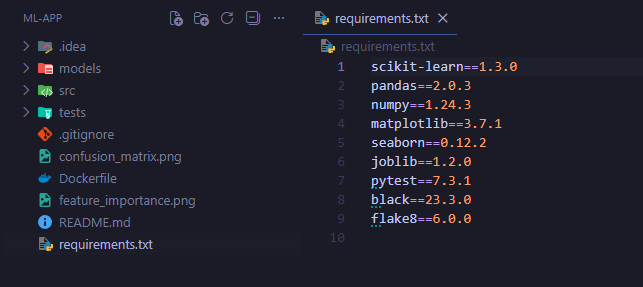

The structure screenshot confirms the presence of `requirements.txt`, `src/` directory with Python modules (`train.py`, `model.py`), `tests/` directory with test files, and the `Dockerfile`.

## Task 2: Run the App Locally

### What I Did:
1. **Created a Python virtual environment** using `python -m venv .venv` to isolate project dependencies from the system Python installation.
2. **Activated the virtual environment** using the Windows PowerShell activation script.
3. **Installed all required dependencies** from `requirements.txt` including scikit-learn, Flask, pytest, and other ML libraries.
4. **Trained the Iris classification model** by running `python src/train.py`, which trains a Random Forest classifier and saves it to the `models/` directory.

### Detailed Commands Executed:
```powershell
python -m venv .venv
.venv\Scripts\Activate.ps1
pip install -r requirements.txt
python src/train.py
curl -X POST http://localhost:5000/predict -H "Content-Type: application/json" -d '{"features": [5.1, 3.5, 1.4, 0.2]}'
```

### Screenshots:

**Creating the virtual environment:**

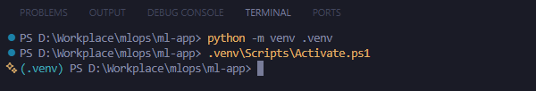

**Installing dependencies from requirements.txt:**

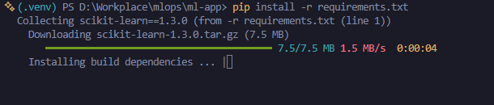

**Training the model successfully:**

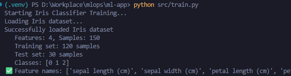

**Testing the model post training with sample iris data:**

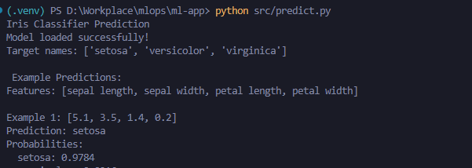

## Task 3: Write Unit Tests

### What I Did:
1. **Created comprehensive unit tests** in `tests/test_model.py` using the pytest framework.
2. **Implemented 8 distinct test functions** covering all critical aspects of the ML pipeline:
   - `test_model_initialization()` - Verifies the IrisClassifier initializes correctly with untrained state
   - `test_model_training()` - Confirms the model can be trained and its trained flag is set
   - `test_model_prediction()` - Validates prediction functionality returns correct format and length
   - `test_model_evaluation()` - Checks evaluation metrics (accuracy between 0-1, classification report)
   - `test_model_save_load()` - Tests model persistence and that loaded models produce identical predictions
   - `test_data_loading()` - Validates data loading produces correct feature/sample counts
   - `test_data_format()` - Ensures features are numeric and labels are integers
   - `test_prediction_range()` - Confirms predictions are valid class labels (0, 1, or 2)
3. **Used pytest fixtures and setup methods** to ensure test isolation with fresh classifier instances.
4. **Ran the complete test suite** locally to verify all tests pass before CI integration.

### Command Executed:
```powershell
pytest tests/ -v
```

### Screenshots:

**All unit tests passing successfully:**

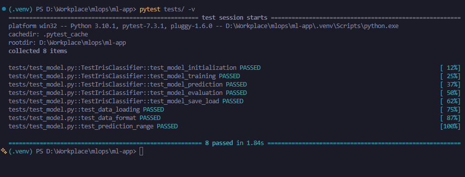

The screenshot shows all 8 tests passed, covering model initialization, training, prediction, evaluation, save/load functionality, data loading, data format validation, and prediction range checks. The test suite provides comprehensive coverage of core ML functionality and data handling.

## Task 4: Linting & Formatting

### What I Did:
1. **Installed flake8** flake8 was already in the `requirements.txt`.
2. **Created a `.flake8` configuration file** to define linting rules:
   - Set `max-line-length = 120` to allow reasonable line lengths for ML code
   - Configured `exclude` patterns for `.git`, `__pycache__`, `.venv`, `.pytest_cache`, etc.
   - Added strategic `ignore` rules for specific error codes that don't apply to this ML project (E203, W503, etc.)
   - Set `per-file-ignores` for `__init__.py` files to allow unused imports
3. **Ran flake8 on source and test directories** to verify code quality.
4. **Fixed all linting violations** to ensure clean code that passes style checks.

### Configuration Details:
The `.flake8` file includes sensible defaults for Python ML projects, balancing code quality with practical considerations for scientific computing code.

### Command Executed:
```powershell
flake8 src/ tests/
```

### Screenshots:

**Flake8 linting passing with no errors:**

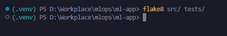

The screenshot confirms that running `flake8 src/ tests/` produces no output, indicating all code meets the defined style standards. A clean flake8 run is essential for maintaining code quality and readability across the project.

## Task 5: GitHub Actions CI Workflow

### What I Did:
1. **Created `.github/workflows/ci.yml`** to define the continuous integration pipeline.
2. **Configured workflow triggers** to run on:
   - Every push to `main` or `master` branches
   - Every pull request targeting `main` or `master` branches
3. **Implemented a comprehensive CI pipeline** with the following sequential steps:
   - **Checkout code**: Uses `actions/checkout@v3` to clone the repository
   - **Setup Python**: Uses `actions/setup-python@v4` to install Python 3.10
   - **Install dependencies**: Upgrades pip and installs all packages from `requirements.txt`, plus flake8 and pytest
   - **Lint code**: Runs `flake8 src/ tests/` to enforce code quality standards
   - **Execute tests**: Runs `pytest tests/ -v` to validate all unit tests pass
   - **Build Docker image**: Builds the containerized app with `docker build -t ml-app:latest .`
   - **Export Docker image**: Saves the image to a tar file with `docker save`
   - **Upload artifact**: Uses `actions/upload-artifact@v4` to make the Docker image available as `docker-image-artifact`

### Key Design Decisions:
- Used **Python 3.10** to match local development environment
- Installed linting and testing tools separately to ensure they're available even if not in `requirements.txt`
- **Exported Docker image as artifact** so it can be downloaded, inspected, or deployed without rebuilding
- Pipeline **fails fast** - if linting fails, tests won't run; if tests fail, Docker build won't happen. This is a best practice I learnt throughout internships.

### Workflow Configuration (`.github/workflows/ci.yml`):
```yaml
name: ML CI Pipeline

on:
  push:
    branches: [ main, master ]
  pull_request:
    branches: [ main, master ]

jobs:
  build:
    runs-on: ubuntu-latest
    
    steps:
    - name: Checkout repository
      uses: actions/checkout@v3
    
    - name: Setup Python environment
      uses: actions/setup-python@v4
      with:
        python-version: '3.10'
    
    - name: Install project dependencies
      run: |
        python -m pip install --upgrade pip
        pip install -r requirements.txt
        pip install flake8 pytest
    
    - name: Lint code
      run: |
        flake8 src/ tests/
    
    - name: Execute tests
      run: |
        pytest tests/ -v
    
    - name: Build container image
      run: |
        docker build -t ml-app:latest .
    
    - name: Export container image
      run: |
        docker save ml-app:latest -o ml-app-image.tar
    
    - name: Upload container artifact
      uses: actions/upload-artifact@v4
      with:
        name: docker-image-artifact
        path: ml-app-image.tar
```

### Screenshots:

**Successful GitHub Actions CI pipeline run:**

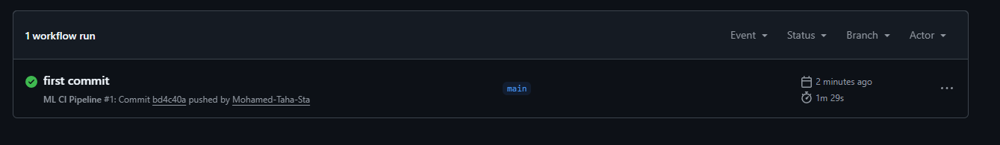

The screenshot shows the complete CI pipeline executing successfully on GitHub Actions, with all steps passing: checkout, Python setup, dependency installation, linting, testing, Docker build, and artifact upload. The green checkmarks confirm the code meets all quality standards and builds successfully.

> Note: Since the main objective wasn't necessarily git for this assignment, I put it below. This shows my first commit and push which I will cover in detail near the end of the report.

## Task 6: Containerise the App

### What I Did:
1. **Created a Dockerfile** that defines how to build a containerized version of the ML application.
2. **Selected `python:3.10-slim` as the base image** to minimize image size while maintaining full Python functionality.
3. **Structured the Dockerfile with best practices**:
   - Set working directory to `/app` for clean organization
   - Copy `requirements.txt` first and install dependencies (leverages Docker layer caching)
   - Copy all application code after dependency installation
   - Create `models/` directory for model artifacts
   - Set default command to train the model with `python src/train.py`
4. **Built the Docker image locally** to verify it works before CI integration.
5. **Ran the containerized application** to confirm training works inside the container.

### Dockerfile Contents:
```dockerfile
FROM python:3.10-slim

WORKDIR /app

COPY requirements.txt .

RUN pip install --upgrade pip && \
    pip install -r requirements.txt

COPY . .

RUN mkdir -p models

CMD ["python", "src/train.py"]
```

### Commands Executed:
```powershell
# Build the Docker image
docker build -t ml-app:latest .

# Run training in the container
docker run ml-app:latest

# Run with port mapping for Flask app (if needed)
docker run -p 5000:5000 ml-app:latest
```

### Design Decisions:
- **Slim base image** reduces attack surface and image size
- **Layer caching optimization** by copying requirements.txt separately
- **Default CMD trains the model**, making the container immediately useful
- **Port exposure** (implicit via Flask) allows container to serve predictions
- **Models directory creation** ensures the container can save trained models

### Screenshots:

**Docker image build process:**

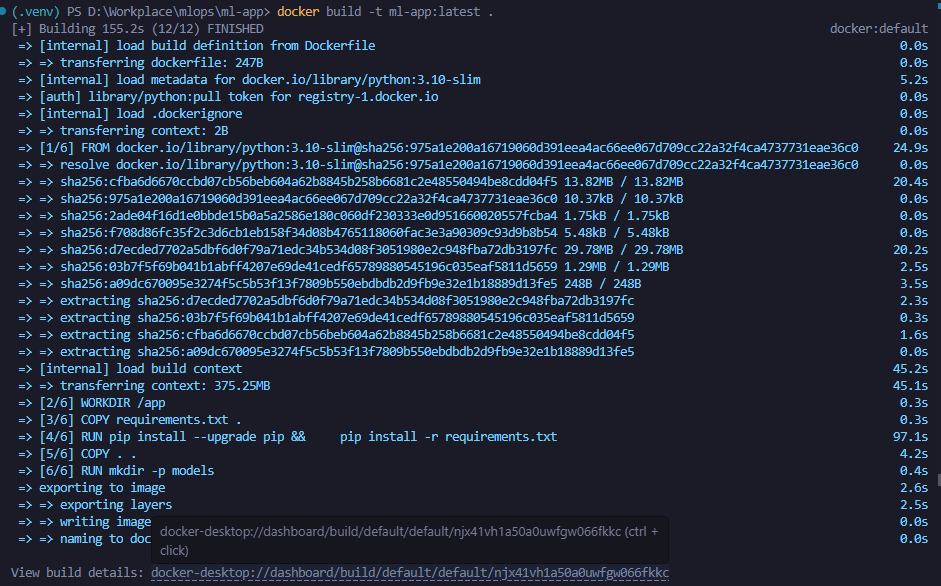

**Running the containerized application:**

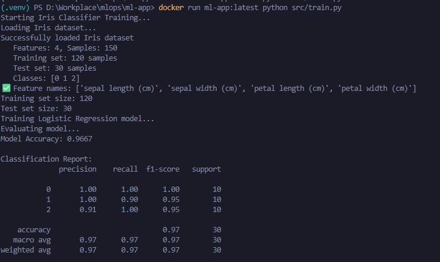

The screenshots demonstrate successful Docker image creation and execution. The build process installs all dependencies and creates the image, while the run screenshot shows the model training inside the container, confirming the Dockerfile produces a functional, runnable container.

## CI/CD Pipeline Behavior and Benefits

### Pipeline Execution Flow:
When code is pushed to the repository or a pull request is opened, the GitHub Actions workflow automatically executes the following sequence:

1. **Code Checkout** - Fresh copy of the repository is cloned
2. **Environment Setup** - Python 3.10 is installed and configured
3. **Dependency Installation** - All required packages are installed
4. **Code Linting** - flake8 checks code style; **pipeline fails if violations exist**
5. **Unit Testing** - pytest runs all tests; **pipeline fails if any test fails**
6. **Docker Build** - Container image is built; **pipeline fails if Dockerfile has errors**
7. **Artifact Upload** - Docker image is saved and uploaded for later use

### Benefits of This CI/CD Approach:

**1. Early Bug Detection:**
- Automated tests catch regressions before code is merged
- Every change is validated against the test suite
- Integration issues are identified immediately

**2. Code Quality Enforcement:**
- Linting ensures consistent code style across all contributors
- Style violations prevent merge, maintaining clean codebase
- Reduces technical debt and improves readability

**3. Automated Artifact Production:**
- Docker image is built automatically on every successful run
- Image can be downloaded from GitHub Actions artifacts
- Eliminates "works on my machine" problems

**4. Fast Feedback Loop:**
- Developers know within minutes if their changes broke something
- No need to wait for manual testing
- Reduces time between code and production

**5. Reproducible Builds:**
- Docker containerization ensures identical environments
- Dependencies are locked and consistent
- Same image works in development, testing, and production

**6. Deployment Readiness:**
- Docker artifact can be pushed to registry (Docker Hub, ECR, GCR)
- Ready for deployment to cloud platforms (AWS, Azure, GCP)
- Supports continuous deployment if desired

### Pipeline Failure Handling:
The pipeline uses **fail-fast** behavior - if any step fails, subsequent steps are skipped. This saves CI resources and provides immediate feedback to developers about what needs to be fixed.

### Screenshots:

**Complete CI pipeline execution with artifact generation:**


The screenshot confirms the entire pipeline executed successfully, with all jobs completing and the Docker image artifact available for download. This demonstrates the end-to-end automation from code commit to deployable artifact.

## Running the Project Locally

### Using Virtual Environment (Recommended for Development)

This approach isolates project dependencies and is ideal for development and debugging.

**Windows PowerShell:**
```powershell
# Create virtual environment
python -m venv .venv

# Activate environment
.venv\Scripts\Activate.ps1

# Install dependencies
pip install -r requirements.txt

# Train the model
python src/train.py
```

### Using Docker (Recommended for Production)

This approach uses containerization for consistent environments across all machines.

```powershell
# Build the Docker image
docker build -t ml-app:latest .

# Run model training in container
docker run ml-app:latest
```

### Running Tests:
```powershell
# Activate virtual environment first
.venv\Scripts\Activate.ps1

# Run all tests with verbose output
pytest tests/ -v

# Run specific test file
pytest tests/test_model.py -v
```

### Running Linter:
```powershell
# Activate virtual environment first
.venv\Scripts\Activate.ps1

# Lint source and test directories
flake8 src/ tests/

# Lint specific file
flake8 src/model.py
```

## Version Control and Submission

### Git Workflow Used:

**Initial repository setup:**

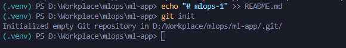

**Committing:**

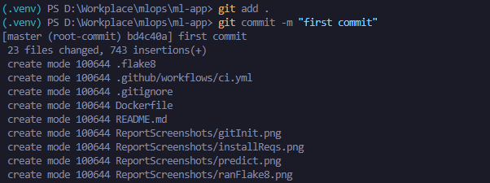

**Pushing to remote repository:**

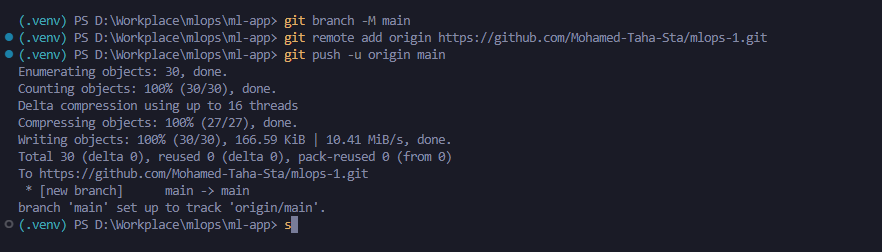

These screenshots document the Git workflow used throughout the assignment, showing proper version control practices including initialization, commits with descriptive messages, and pushing changes to the remote GitHub repository.

## Conclusion

This assignment successfully demonstrates the implementation of a complete CI/CD pipeline for a machine learning application.

- **Automated Testing**: Comprehensive pytest suite with 8 tests covering all critical functionality
- **Code Quality**: Enforced through flake8 linting with custom configuration
- **Containerization**: Docker-based deployment for consistent, reproducible environments
- **Continuous Integration**: GitHub Actions pipeline that automatically validates every change
- **Artifact Management**: Automated Docker image generation and storage

The pipeline ensures that every code change is automatically tested, linted, and packaged, significantly reducing the risk of bugs reaching production while maintaining high code quality standards. The containerized approach guarantees that the application runs identically across development, testing, and production environments.

### Repository Information:
- **Repository**: [Mohamed-Taha-Sta/mlops-1](https://github.com/Mohamed-Taha-Sta/mlops-1)
- **Branch**: main
- **CI Status**: All checks passed with flying colors.

Thank you for reading!